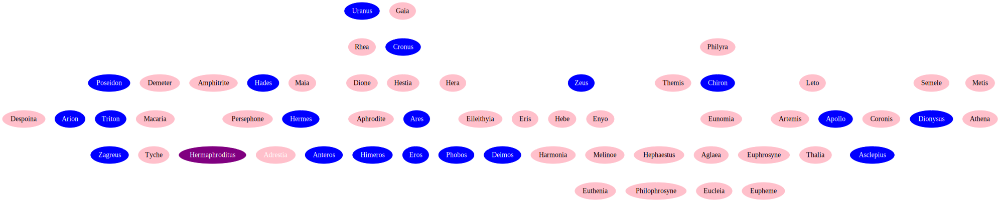

# Greek Mythology
An incomplete geneology graph made with GraphViz

## Dependencies
[Graphviz](http://www.graphviz.org/) (`sudo apt-get install graphviz` or `brew install graphviz`)

## Install
```bash
git clone git@gitlab.com:bagrounds/greek-mythology
```

## Generate Graph
```bash
cd greek-mythology
./graph.sh
```

## Geneology Graph


## License
[MIT](LICENSE)
